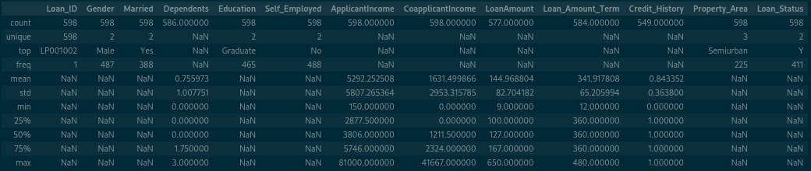
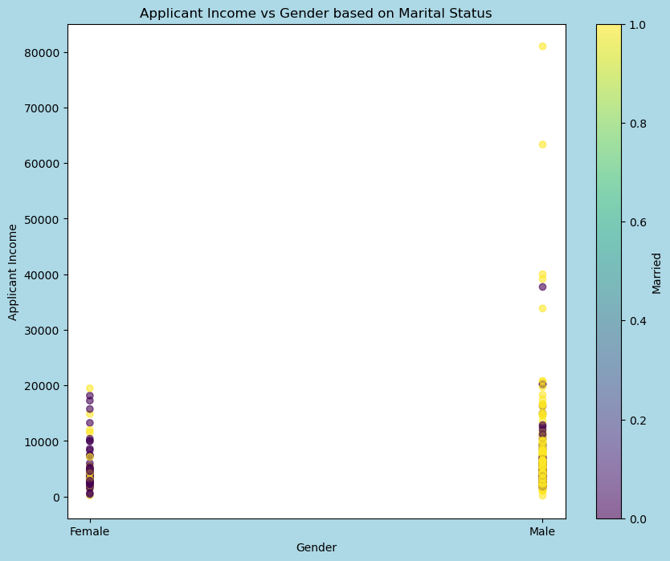
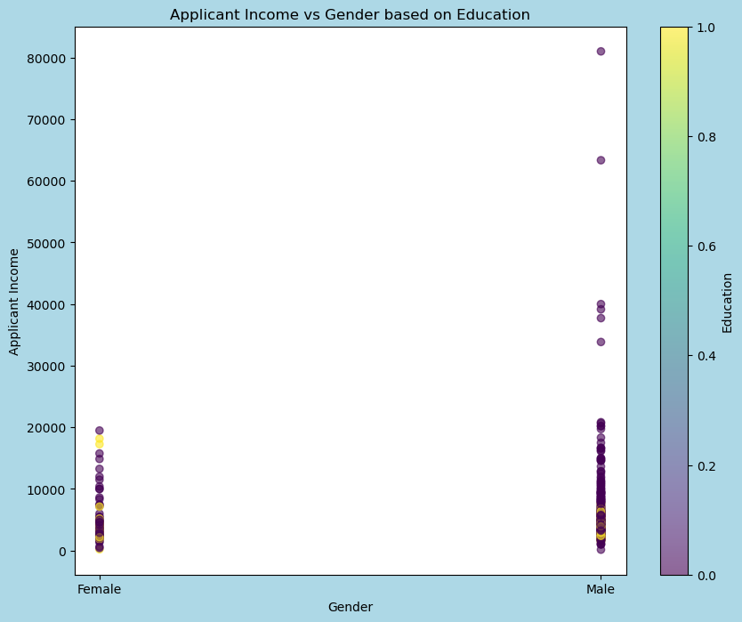
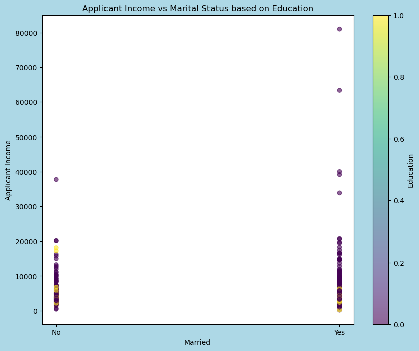
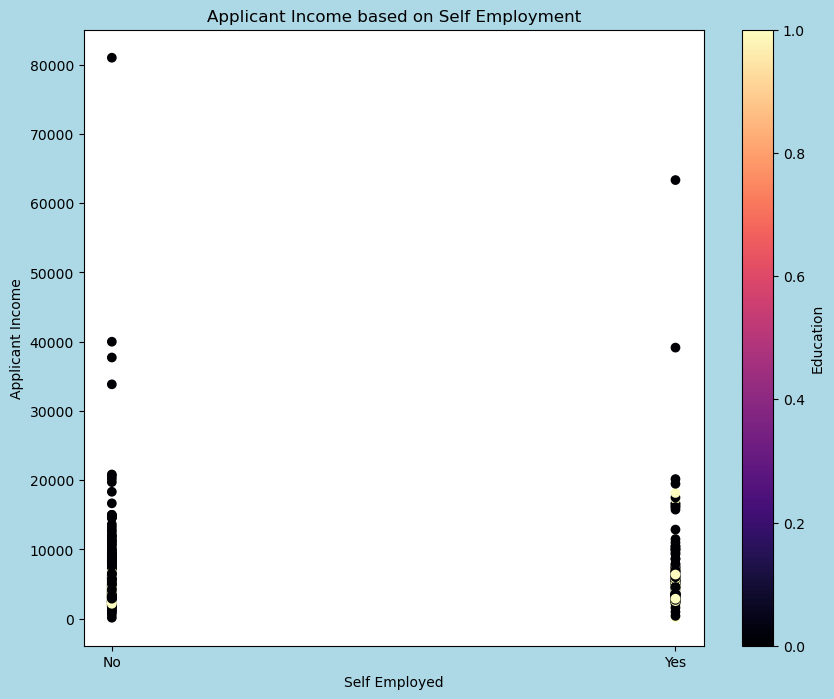
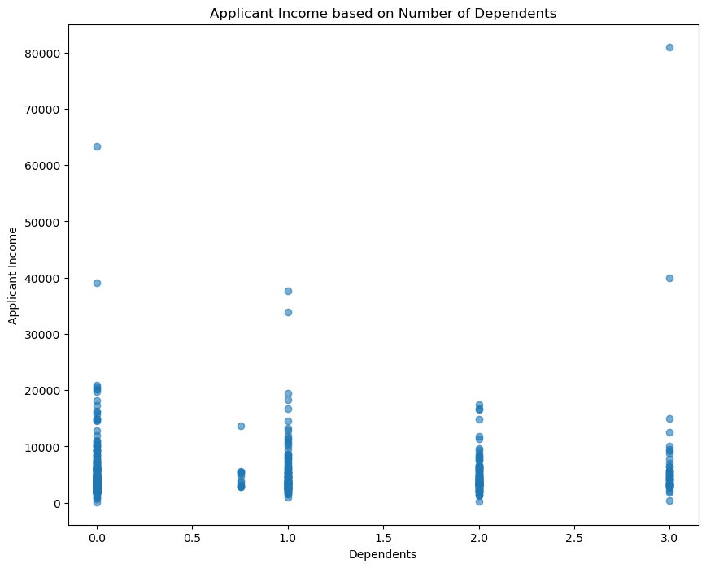
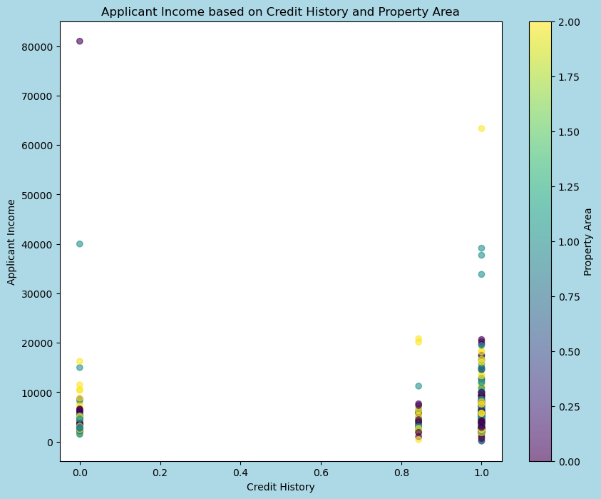
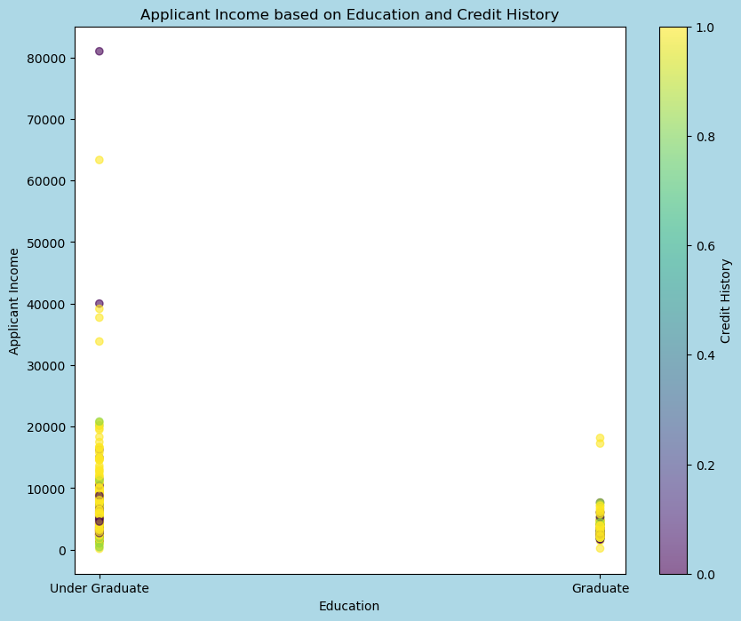
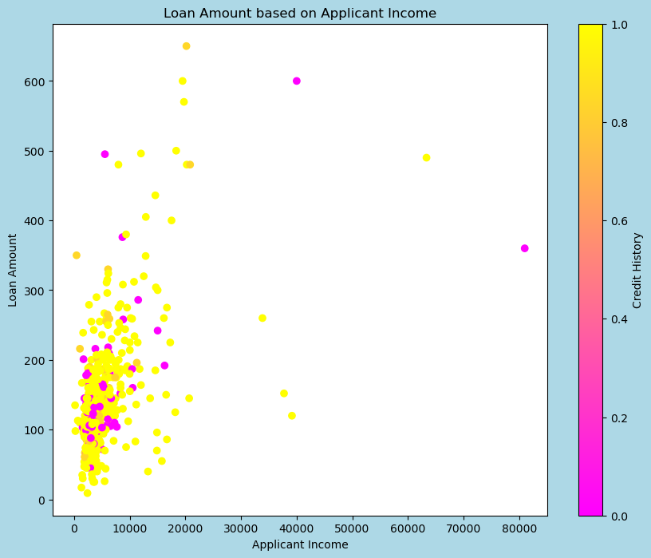
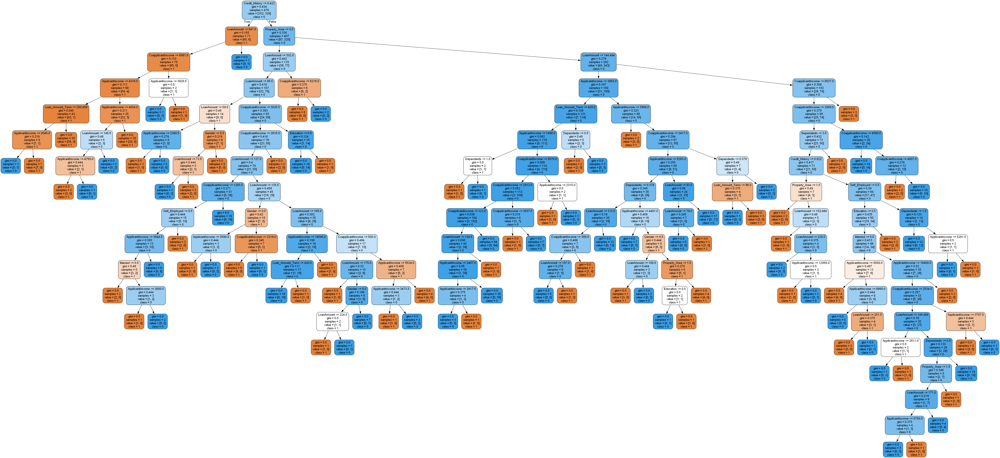

---
jupyter:
  kernelspec:
    display_name: base
    language: python
    name: python3
  language_info:
    codemirror_mode:
      name: ipython
      version: 3
    file_extension: .py
    mimetype: text/x-python
    name: python
    nbconvert_exporter: python
    pygments_lexer: ipython3
    version: 3.11.4
  nbformat: 4
  nbformat_minor: 2
---

# Project Statement

### The goal of this project is to leverage machine learning methods to analyze data from a set of banks so that a bank can make lending decisions to applicants based on their characteristics (predicting loan eligibility based on client details). The information regarding the loan applications from a set of banks is listed in the file Loan.csv."

## Part A

#### 1. Display the information about the data in this dataset

    <class 'pandas.core.frame.DataFrame'>
    RangeIndex: 598 entries, 0 to 597
    Data columns (total 13 columns):
     #   Column             Non-Null Count  Dtype  
    ---  ------             --------------  -----  
     0   Loan_ID            598 non-null    object
     1   Gender             598 non-null    object
     2   Married            598 non-null    object
     3   Dependents         586 non-null    float64
     4   Education          598 non-null    object
     5   Self_Employed      598 non-null    object
     6   ApplicantIncome    598 non-null    int64  
     7   CoapplicantIncome  598 non-null    float64
     8   LoanAmount         577 non-null    float64
     9   Loan_Amount_Term   584 non-null    float64
     10  Credit_History     549 non-null    float64
     11  Property_Area      598 non-null    object
     12  Loan_Status        598 non-null    object
    dtypes: float64(5), int64(1), object(7)
    memory usage: 60.9+ KB

#### 2. Display the calculation of basic statistical operations

## Part B: Visualization of Results

#### 1. Applicant's income based on gender and marital status (Married)

#### 2. Applicant's income based on gender and level of education

#### 3. Applicant's income based on marital status and level of education

#### 4. Applicant's income based on the type of employment (Self_Employed)

#### 5. Applicant's income based on the number of dependents

#### 6. Applicant's income based on the number of previous credits and location

#### 7. Applicant's income based on the level of education and number of previous credits

### B. Show the loan amount based on the applicant's income

### Visualization of the decision tree

